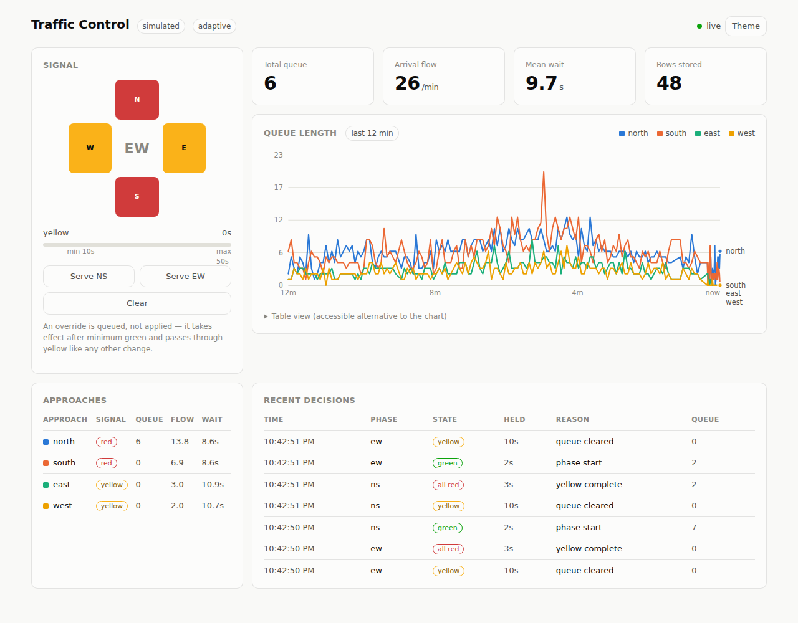

# Smart Traffic Management System

Adaptive traffic signal control driven by computer vision. Cameras watch the
approaches to a junction, YOLO detects vehicles, a tracker turns detections into
queues and flow rates, and a signal controller uses those to decide how long each
phase gets green.

Built as an engineering project. The emphasis is on measuring whether it works
rather than asserting that it does, so the results below are reproducible and the
limitations are stated rather than omitted.



*Live dashboard: signal state, per-approach queues, flow over time, and the
controller's decision log with the reason each phase ended.*

---

## Results

**Adaptive control reduces average delay by 29.6% against the best fixed-time
schedule**, over 12 simulated hours at an asymmetric junction. Every strategy
faces an identical arrival sequence (same RNG seed), so the comparison is a
measurement, not a coincidence.

| strategy | avg delay | vehicles served | peak queue |
|---|---:|---:|---:|
| fixed 25s | 13.6 s | 16,418 | 20.0 |
| fixed 35s | 16.3 s | 16,413 | 23.0 |
| fixed 50s | 20.8 s | 16,420 | 31.0 |
| **adaptive** | **9.6 s** | **16,448** | **14.0** |

Delay falls without sacrificing throughput — adaptive serves slightly *more*
vehicles — and peak queue drops from 20 to 14, so the gain shows up in two
independent measures.

```
python tools/simulate.py compare --hours 12
```

**Traffic prediction beats a seasonal-naive baseline by 27.5%.** An LSTM forecasts
vehicle flow 15 minutes ahead at MAE 2.565 vehicles/minute, against 3.537 for
"however many crossed at this minute yesterday".

| model | MAE | RMSE | R² | skill vs naive |
|---|---:|---:|---:|---:|
| mean | 5.180 | 6.576 | −0.000 | −46.5% |
| persistence | 3.568 | 5.131 | 0.391 | −0.9% |
| seasonal naive | 3.537 | 5.039 | 0.413 | baseline |
| gradient boosting | 2.602 | 3.737 | 0.677 | +26.4% |
| **LSTM** | **2.565** | **3.672** | **0.688** | **+27.5%** |

The baseline is the point. An MAE reported alone means nothing until you know
what a trivial method scores on the same data.

```
python tools/train.py --camera north --horizon 15 --model both
```

**Detection verified on real footage.** On a real fixed-camera highway clip, the
pipeline counted 9–11 vehicles crossing in 21.5 seconds, measuring cars at
99–113 km/h and trucks at 65–78 km/h. Trucks being slower than cars is a useful
sign the measurement is real rather than coincidentally plausible.

---

## Quick start

```bash
pip install -r requirements.txt
alembic upgrade head
python tools/doctor.py          # checks the install and says what to fix
python app.py --mode simulated --speed 20
```

Then open <http://127.0.0.1:5000>.

`--speed 20` compresses simulated time, so a rush hour builds and clears in a
couple of minutes rather than an afternoon.

---

## What is real and what is simulated

This distinction matters and is easy to blur, so it is stated plainly.

| Component | Validated against |
|---|---|
| Detection, tracking, line counting, speed | **Real footage** |
| Database, API, dashboard | **Real**, running live |
| Signal control, delay comparison | **Simulation** |
| Traffic prediction (LSTM) | **Simulated history** |

Signal control cannot be measured against recorded footage. A recording is fixed:
the vehicles in it did what they did, and they will do the same thing however the
signal behaves. Claiming "adaptive control reduced delay" requires a world that
*responds* — where a longer green actually clears more vehicles and a shorter one
actually leaves them waiting. That is what the closed-loop simulator provides.

So: real footage proves the detector sees vehicles correctly. The simulator proves
the controller uses that information well. Both are needed and neither substitutes
for the other.

The prediction results carry a further caveat: the simulator generates the
pattern the model then "discovers", so a good score is somewhat circular. Re-run
on real history before making claims about it.

---

## Architecture

```
  camera / video file
          |
   CameraStream          background thread, keeps only the newest frame
          |
    ObjectDetector       YOLOv8, model loaded once at startup
          |
   CentroidTracker       stable IDs across frames (Hungarian assignment)
     + LineCounter       counts each vehicle once as it crosses the stop line
          |
   TrafficSnapshot       queue length, flow rate, dwell time, speed
          |
    +-----+------------------------+
    |                              |
 SnapshotWriter          IntersectionController
 5s buckets, batched     state machine + pluggable Strategy
    |                              |
 SQLite / PostgreSQL     signal_events (the audit trail)
    |                              |
    +-----+------------------------+
          |
    Flask API  ->  dashboard
```

**Why tracking is not optional.** A detector answers "what is in this frame" and
has no memory. One car waiting at a red light for 20 seconds at 30fps is detected
600 times. Summing that gives 600 "vehicles". The tracker assigns stable IDs, which
is what makes flow rate, queue length and dwell time computable at all — and those
are the only quantities a signal controller can act on.

**Why the controller is a state machine.** A signal has invariants that must hold
regardless of what any algorithm decides: green never becomes red without yellow,
conflicting approaches are never green together, green is never shorter than
`min_green` or longer than `max_green`. Those live in the state machine, which owns
every transition. A `Strategy` may only answer one question — extend this green, or
end it? A buggy strategy degrades timing; it cannot produce an unsafe signal.

That split is also what makes prediction pluggable: `MLStrategy` is a subclass, and
the controller does not change.

---

## Tools

| Command | What it does |
|---|---|
| `python tools/doctor.py` | Checks the whole install; says what to fix |
| `python tools/check_footage.py <video>` | Is this clip usable? Static camera? Anything queuing? |
| `python tools/calibrate.py <video>` | Click the counting line and scale; prints YAML to paste |
| `python tools/simulate.py compare` | Fixed vs adaptive delay comparison |
| `python tools/simulate.py generate --days 21` | Write simulated history for model training |
| `python tools/train.py --camera north` | Train and evaluate forecasters against baselines |
| `python tests/run_all.py` | 174 tests across five suites |

---

## Using your own footage

```bash
python tools/check_footage.py data/my_junction.mp4   # is it usable?
python tools/calibrate.py data/my_junction.mp4       # click the line and scale
# paste the printed block into config/config.yaml
python app.py --mode live
```

Two requirements the footage must meet, both of which `check_footage.py` verifies:

**The camera must be static.** Drone or handheld footage makes every vehicle
appear to move, so queue length reads zero forever and speeds are meaningless.
The drift is often too slow to notice by watching, which is why it is measured.

**Traffic must actually queue.** A free-flowing motorway clip passes every other
test and still cannot demonstrate signal control — nothing stops, so there is no
delay to reduce.

Two values in `config.yaml` cannot be guessed and must be set per camera:
`counting_line` (flow rate is meaningless without it) and `pixels_per_meter`
(speeds are reported as uncalibrated without it, which is correct and honest).

**Calibrate the scale ALONG the road, not across it.** A camera looking down a
road has two different scales: lateral (lane width) and longitudinal (into the
frame). Perspective compresses the longitudinal axis far more. On the sample
footage lane width gave ~53 px/m while the along-the-road scale was ~7.5 px/m —
a factor of seven. Using lane width reported motorway traffic at 4.7 km/h.

---

## Known limitations

**No auto-rickshaw class.** YOLOv8 ships trained on COCO, whose classes include
`car`, `bus`, `truck`, `motorcycle` and `bicycle` — but no auto-rickshaw. On Indian
footage autos are classified inconsistently or missed, and dense two-wheeler
clusters get merged. Fine-tuning on Indian vehicle classes is the most defensible
extension to this work.

**Prediction does not help an isolated junction.** Measured, not assumed: an
*oracle* predictor given the true future performed 0.94% **worse** than plain
adaptive control. Adaptive already observes the queue directly, and greens last
about ten seconds, so a fifteen-minute forecast is irrelevant by the time its
traffic arrives. Forecasting earns its place on coordinated corridors, on long
cycles, and for anticipating a peak to re-time a whole plan — not here. Since the
oracle is an upper bound, no better model would change this.

**Tracking loses identity through long occlusions.** Centroid tracking is cheap
and dependency-light but will drop a car hidden behind a bus for two seconds. The
upgrade path is a Kalman filter plus appearance embeddings (ByteTrack/DeepSORT);
the interface would not change.

**Detection runs at ~10 fps on CPU** at 720p, below a 25 fps source. The capture
thread drops frames rather than queuing them, so the system always analyses what
the camera sees *now* — lagging would be worse than dropping.

**No authentication.** Every API endpoint is open, including the signal override.
Fine on localhost, unacceptable on a network.

**Single junction.** The controller manages one intersection. Coordinating several
(green waves) is where prediction would start to pay off.

---

## Project layout

```
config/config.yaml        all settings; cameras, signals, thresholds
src/
  detector.py             YOLOv8 wrapper, model cached at startup
  tracker.py              centroid tracking + line counting
  data_collector.py       threaded capture, per-camera pipeline
  traffic_controller.py   signal state machine + control strategies
  simulator.py            closed-loop traffic simulation
  api.py                  REST endpoints
  database/               SQLAlchemy models, buffered writer, queries
  models/                 features, baselines, LSTM
  utils/                  config loading and validation, logging
alembic/                  schema migrations
templates/dashboard.html  live dashboard
tools/                    doctor, calibrate, check_footage, simulate, train
tests/                    174 tests; run_all.py runs them
app.py                    entry point
```

---

## Database

Runs on SQLite by default — one file, no server. Moving to PostgreSQL is three
steps: set `type: "postgresql"` in `config.yaml`, put a password in `.env`, run
`alembic upgrade head`. No application code changes, because `database_url()` is
the only function that knows which backend exists.

Three differences between the two are handled explicitly, because they fail
silently otherwise: SQLite has no timezone-aware timestamp type (a `UTCDateTime`
decorator forces UTC both ways and rejects naive datetimes), SQLite does not
enforce foreign keys unless `PRAGMA foreign_keys=ON` is set, and SQLite only
auto-increments `INTEGER PRIMARY KEY` columns.

Frames are aggregated into 5-second buckets before storage. At 30fps one camera
would otherwise produce 2.6 million rows a day, at a resolution nothing reads.
Each field uses the statistic that preserves its meaning: queue length takes the
**max** (the peak is what must be cleared), crossings take the **sum**, vehicle
count takes the **mean**, and speed stays **NULL** when the camera is uncalibrated
rather than becoming a zero that would read as a traffic jam.

---

## Testing

```bash
python tests/run_all.py          # all 174
python tests/run_all.py --fast   # skip the slow simulation suites
```

Each suite runs in its own process, because they stub `cv2` and `ultralytics` at
import time and sharing an interpreter would let one suite's stubs leak into
another's.

The safety tests are adversarial rather than optimistic. An `AlwaysStop` strategy
demands the phase end on every tick and an `AlwaysExtend` never yields; across
thousands of ticks the machine still never goes green→red without yellow, never
cuts below `min_green`, never exceeds `max_green`, and still serves both phases
equally. A strategy that behaves itself proves nothing about whether the machine
would stop one that did not.

---

## Acknowledgements

Sample footage from the [Roboflow Supervision](https://supervision.roboflow.com/latest/assets/)
example assets. Detection uses [Ultralytics YOLOv8](https://github.com/ultralytics/ultralytics).
Saturation-flow and delay definitions follow standard traffic-engineering practice.
